#周总结
##概述
   周一周二完成分配的任务

   学习了[spring boot](#springboot)相关知识

   尝试将之前做的评论test绑到wcm没有成功，用wcm生成的概览页面添加了[评论test总览页面](#test)

##spring boot

**什么是spring boot**

Spring boot是Spring团队为了摆脱XML配置文件，在开发过程中使用“约定优先配置”（convention over configuration）的思想的开发框架，从根本上来讲，他是一个各种库的集合，可以被任意项目的构建系统所使用。

**spring boot是如何执行WEB项目的？**

在SpringApplication.run()方法执行之后，Spring boot的autoconfigure会发现这是一个Web应用（会根据注释来确定），就会在内嵌的Tomcat服务器中启动一个Spring的应用，并且默认端口为8080.然后在Spring Context内根据默认配置Spring WebMvc：

   Servlet容器默认的Context路径是/

   DispatherServlet匹配的路径(servlet-mapping中的url-patterns)是/*

   @ComponentScan路径被默认设置为SampleController的同名package，也就是该package下的所有@Controller，@Service, @Component, @Repository都会被实例化后并加入Spring Context中。

**@EnableAutoConfiguration**

   会自动根据你jar包的依赖来自动配置项目

**@SpringBootApplication**

   Spring boot给出代替@EnableAutoConfiguration、@ComponentScan和@Configuration的合集。

**@Configuration**
   
   使用这个注解标注出有main方法的启动类，与XML中配置beans类似

**@Autowired**

   自动导入依赖的bean，如
	
	@Autowired
    private productService pdSv;

   而另一边使用@Service注解

	@Service
	public class commentService

**@Service**
  
   注解Service层组件

**@Repository**

   注解Dao层，如果Dao有这个注解机会被ComponetScan发现并配置，同时也不需要为它们提供XML配置项

**数据库链接**

在application.properties文件内需要配置数据库连接的信息：

	spring.datasource.url=jdbc:mysql://localhost/test
	spring.datasource.username=dbuser
	spring.datasource.password=dbpass
	spring.datasource.driver-class-name=com.mysql.jdbc.Driver	

如果Spring boot发现这些信息，就会根据他们创建DataSource对象，这样我们就可以对数据库进行链接

##项目修改

[Git项目地址](https://github.com/darrkyo/TRScommenttest)：https://github.com/darrkyo/TRScommenttest

由于wcm集成代码的操作没有成功，我就自己尝试使用wcm生成的概览页面来写一个从数据库取值的列表页面，并且对之前的项目进行了一些修改

###新的项目目录
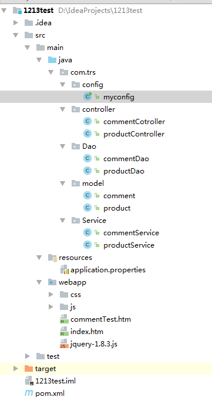

我这里分别添加了列表的三层，和列表的页面index.htm

###旧项目的修改

**1.表结构的修改**

之前测试时候发现评论信息如果使用varchar的话会对评论信息有一个限制，超过规定的字符串就不能输入，提交时候会报错，所以修改成评论信息为text类型

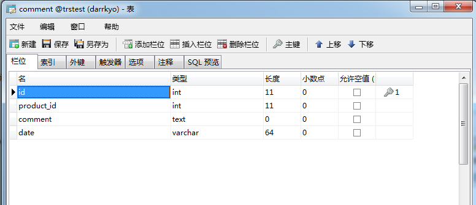

**2.界面的调整**

之前评论界面如果新增评论超出div表格边框会直接显示出来，而且如果评论内容很长会将div挤变形，而且同行的内容也会变形，现在进行修改，并且将以前使用的外div变成fieldSet，代码如下

	<fieldset style="position: absolute;border: 1px solid #999;top: 600px;left: 24%;width: 500px;height: 300px;overflow: auto;padding-bottom: 20px;word-wrap:break-word">
    <legend>评论区</legend>
    <ul id="comments" style="">
    </ul>
	</fieldset>

	<fieldset  style="position: absolute;border: 1px solid #999;top: 600px;left: 53%;width: 500px;height: 150px">
    <legend id="legend1">添加评论</legend>
    <form style="padding-left: 20px;margin-top: -10px" id="addComment">
         <textarea  id="comment" cols="55" rows="4"></textarea>
        <input type="button" id="submitbutton" value="添加">
    </form>
	</fieldset>

效果如下图

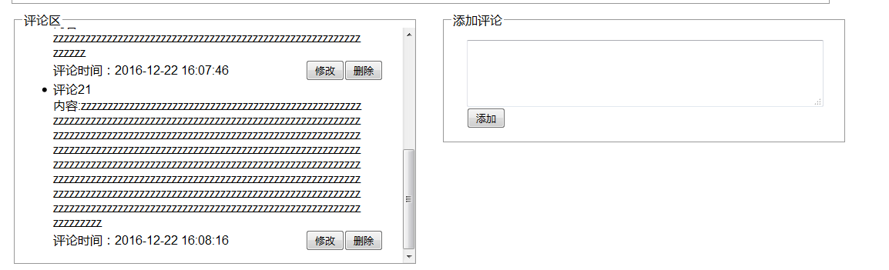

**3.方法修改**

由于需要增加列表页面，即显示的产品不再是固定一个而是通过请求传入，这样就需要从请求中获取点击的产品id，并通过数据库查询出符合该id的文章来进行显示，这里首先我使用到了一个网上查到的方法，用于根据关键字获取请求中的值，如下

	function getQueryString(name) {
            var reg = new RegExp("(^|&)" + name + "=([^&]*)(&|$)", "i");
            var r = window.location.search.substr(1).match(reg);
            if (r != null) return unescape(r[2]); return null;
        }

这样就可以使用该方法获取请求传入的id来确定所需要显示的信息，在界面初始化时候可以对一些信息进行填充，不再是写死在页面上

	$(function () {
            <!--根据传入id获取当前页面需要显示的内容-->
            $.ajax({
                type:"get",
                dataType:"json",
                url:"http://127.0.0.1:8080/product/getProductById?product_id="+getQueryString("product_id"),
                success:function (data) {
                    $("#product_name").html(""+data.product_name)
                    $("#product_info").html("发布日期："+data.product_date+"&nbsp;&nbsp;&nbsp;&nbsp;&nbsp;&nbsp;&nbsp;&nbsp;" +
                        "发布人："+data.product_person+"")
                    $("#product_text").html(""+data.product_text)
                }
            })

效果如下

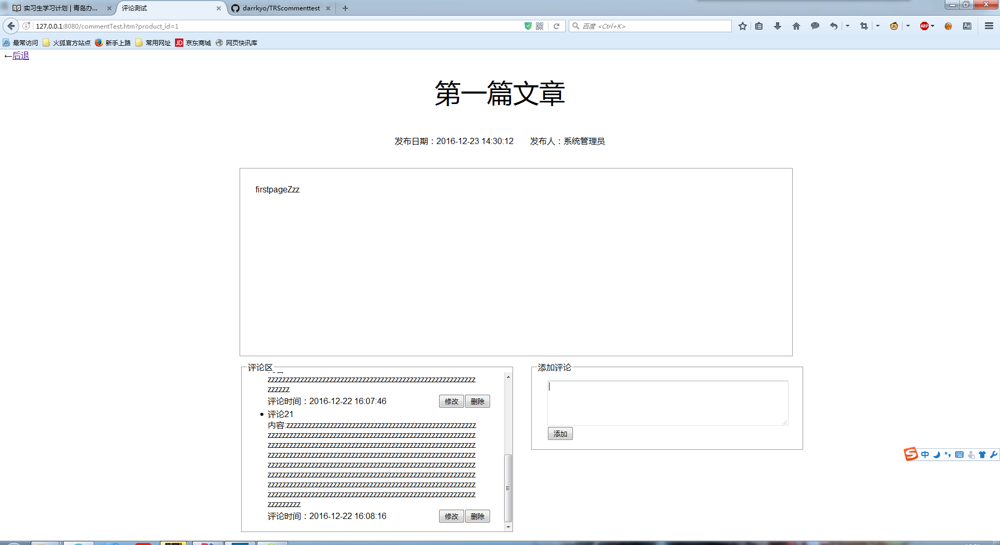

###新添加的功能

新添加了列表页，可以对文章进行新增、修改、删除等操作，新增和修改使用弹出div的方式，该页面原本是wcm生成的概览页面，后经修改如下

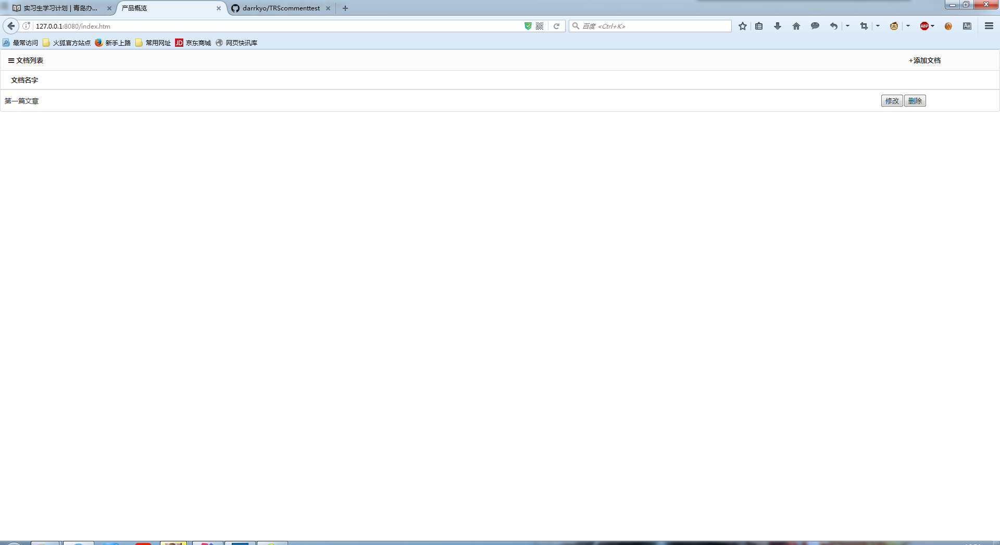

####表结构
这里product_date最后修改日期的格式应该是使用date这里暂时使用varchar字符串来存储，因为暂时还没有判断的内容，如果以后需要date类型比较或者取区间可以使用STR_TO_DATE(date,'%Y年%m月%d日')或者改变成date类型来重新调整表结构

同样的还有product_person创建人这一项，正常来讲应该是作为int类型传入person表的id，这里暂且使用varchar字符串代替，默认使用系统管理员，以后添加操作人时候会将该项修改成为int类型

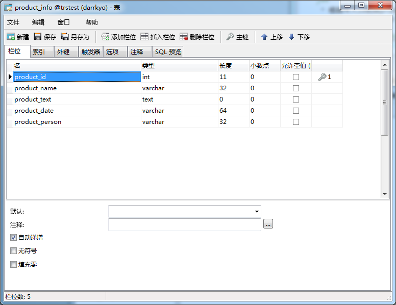

####Dao层

	package com.trs.Dao;

	import com.season.core.db.Dao;
	import org.springframework.stereotype.Repository;

	import javax.annotation.Resources;
	import java.util.List;
	import com.trs.model.product;

	/**
	 * Created by SONY on 2016/12/22.
 	*/
	@Repository
	public class productDao {

    /**
     * 获得全部product
     * @return product集合
     */
    public List<product> getAllProduct(){
        return Dao.findAll(product.class);
    }

    /**
     * 根据id获得product
     * @param productId 需要获得的id
     * @return 返回获得的product
     */
    public product getProductById(int productId){
        return Dao.findById(product.class,productId);
    }

    /**
     * 新增product
     * @param pd 需要新增的product对象
     * @return 返回刚才新增的product对象
     */
    public product addProduct(product pd){
        return Dao.save(pd);
    }

    /**
     * 修改product
     * @param pd 需要修改的product对象
     */
    public void updateProduct(product pd){
        pd.update("product_name","product_text","product_date");
    }

    /**
     * 根据id删除product
     * @param productId 需要删除的id
     */
    public void deleteProduct(int productId){
        Dao.deleteById(product.class,productId);
    }
	}

####Service层

	package com.trs.Service;

	import com.trs.Dao.productDao;
	import org.springframework.beans.factory.annotation.Autowired;
	import org.springframework.stereotype.Repository;
	import com.trs.model.product;

	import java.util.List;

	/**
	 * Created by SONY on 2016/12/22.
	 */
	@Repository
	public class productService {

    @Autowired
    private productDao pdDao;

    /**
     * 获得全部product
     * @return product集合
     */
    public List<product> getAllProduct(){
        return pdDao.getAllProduct();
    }

    /**
     * 根据id获取product
     * @param productId 需要查询的id
     * @return 查询的product对象
     */
    public product getProductById(int productId){
        return pdDao.getProductById(productId);
    }

    /**
     * 新增product
     * @param pd 需要新增的对象
     * @return 返回刚才新增的对象
     */
    public product addProduct(product pd){
        return pdDao.addProduct(pd);
    }

    /**
     * 修改product
     * @param pd 需要修改的对象
     */
    public void updateProduct(product pd){
        pdDao.updateProduct(pd);
    }

    /**
     * 根据传入id删除product
     * @param productId 需要删除的id
     */
    public void deleteProduct(int productId){
        pdDao.deleteProduct(productId);
    }
	}

####Controller
	package com.trs.controller;

	import com.season.core.Controller;
	import com.season.core.ControllerKey;
	import com.trs.Service.productService;
	import com.trs.model.product;
	import org.springframework.beans.factory.annotation.Autowired;

	import java.text.SimpleDateFormat;
	import java.util.Date;

	/**
	 * Created by SONY on 2016/12/22.
	 */
	@ControllerKey("product")
	public class productController extends Controller{

    @Autowired
    private productService pdSv;

    /**
     * 获得全部product方法
     */
    public void getAllProduct(){
        renderJson("productList",pdSv.getAllProduct());
    }

    /**
     * 根据id获得product
     */
    public void getProductById(){
        int product_id=getParaToInt("product_id");
        renderJson(pdSv.getProductById(product_id));
    }

    /**
     * 新增product
     */
    public void addProduct(){
        product pd=new product();
        String product_name=getPara("product_name");
        String product_text=getPara("product_text");
        String date= new SimpleDateFormat("yyyy-MM-dd HH:mm:ss").format(new Date().getTime());
        String product_person="系统管理员";

        pd.setProduct_date(date);
        pd.setProduct_name(product_name);
        pd.setProduct_text(product_text);
        pd.setProduct_person(product_person);

        pdSv.addProduct(pd);
    }

    /**
     * 修改product
     */
    public void updateProduct(){
        product pd=new product();
        int product_id=getParaToInt("product_id");
        String product_name=getPara("product_name");
        String product_text=getPara("product_text");
        String date= new SimpleDateFormat("yyyy-MM-dd HH:mm:ss").format(new Date().getTime());

        pd.setProduct_id(product_id);
        pd.setProduct_date(date);
        pd.setProduct_name(product_name);
        pd.setProduct_text(product_text);

        pdSv.updateProduct(pd);
    }

    /**
     * 根据id删除product
     */
    public void deleteProduct(){
        int product_id=getParaToInt("product_id");
        pdSv.deleteProduct(product_id);
    }
	}

####前台页面
制作时候有考虑窗口变大变小的问题而对页面进行调整

	<!DOCTYPE html>
	<html lang="zh-cn">
	<head>
	<meta http-equiv="Content-Type" content="text/html; charset=utf-8" />
	<meta http-equiv="X-UA-Compatible" content="IE=edge">
	<meta name="viewport" content="width=device-width, initial-scale=1.0, maximum-scale=1.0, user-scalable=no" />
	<meta name="renderer" content="webkit">
	<TITLE>产品概览</TITLE>
	<link rel="stylesheet" href="css/pintuer.css">
	<link rel="stylesheet" href="css/admin.css">
    
	
    
	</head>
	<body>
	<form method="post" action="" id="listform">
 	 

    
<strong class="icon-reorder"> 文档列表<a href="javaScript:openedit();"  style="margin-left: 88%">+添加文档</a></strong> 

    <table class="table table-hover text-center">
      <tr>
        <th width="100" style="text-align:left; padding-left:20px;white-space:nowrap" >文档名字</th>

      </tr>

      <volist name="list" id="vo">
         

         
      </volist>

    </table>
 	 

	</form>

	<fieldset id="editFieldset" style="position: absolute;width:500px;height: 300px;left: 50%;top: 50%;margin-left: -250px;margin-top: -150px;border-width: 3px">
    <legend>新增</legend>
    <form>
        
文章标题：<input id="tittleEdit" style="margin-left: 5px;padding-left: 10px;width: 375px">

        
文章内容：<textarea id="textEdit" cols="55" rows="8" style="margin-left: 5px;padding-left: 10px;margin-top: 20px;resize:none;padding-top: 5px"></textarea>

        
<input id="insertEdit" type="button" onclick="addedit();" value="新增"/> <input type="button" id="closeEdit" onclick="closeedit();" value="关闭">

    </form>
	</fieldset>
	</body>
	</html>

####运行
首先打开程序进入界面，这里我们可以点击新增字样

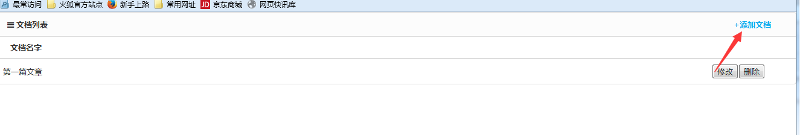

可以在页面中间弹出div，

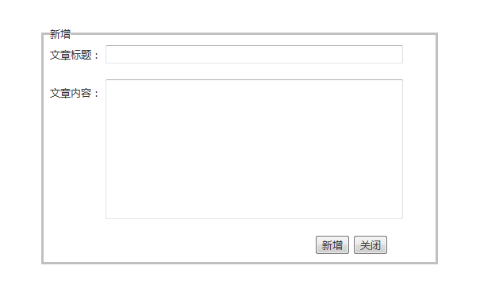

我们在这里输入信息，并点击新增

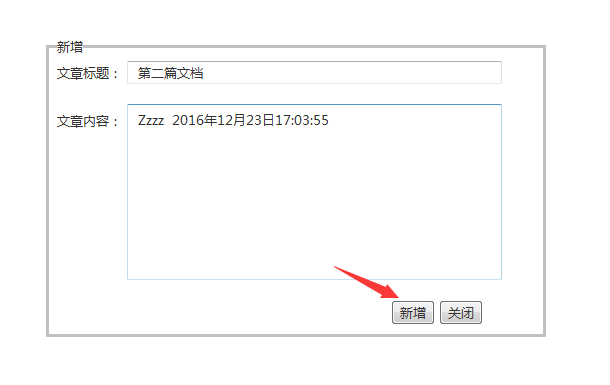

div关闭，然后在页面上可以看到刚才新窗间的文档

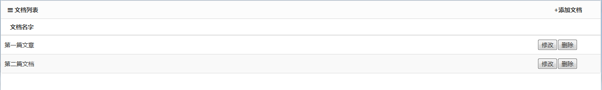

我们点击第二篇文档的名字进入网页，可以看到根据数据库查过来的信息，网页内容有所改变，

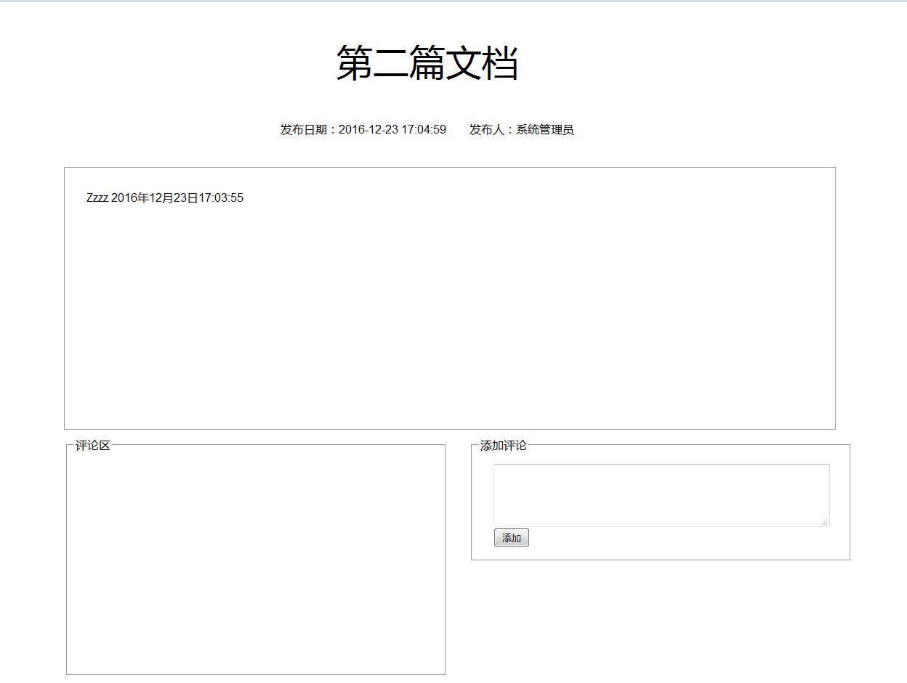
	
这里我们同样可以对评论进行操作

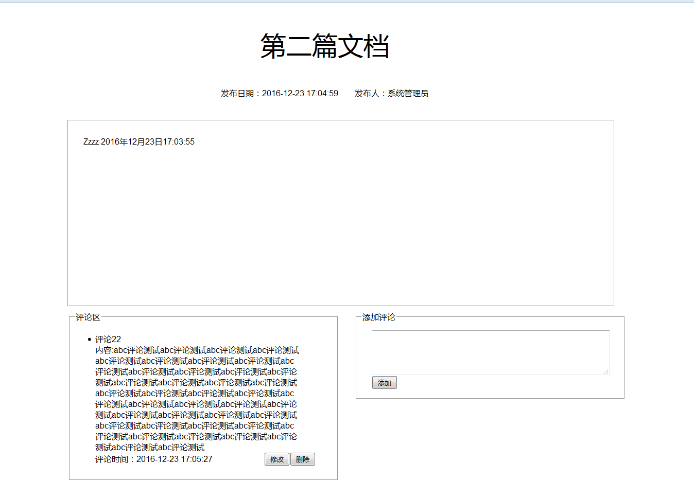

我们点击左上角的后退字样退回到列表页面

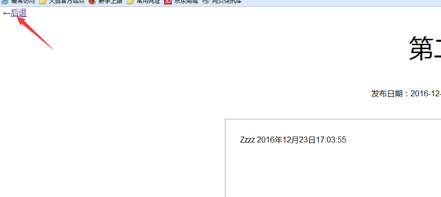

然后我们点击修改按钮

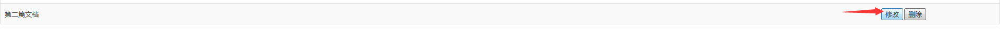

可以看到我们点击这一项内容的信息在页面弹出的div当中

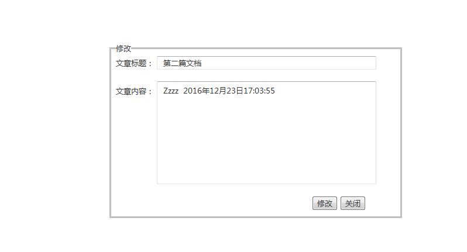

这里我们对内容进行修改并点击修改

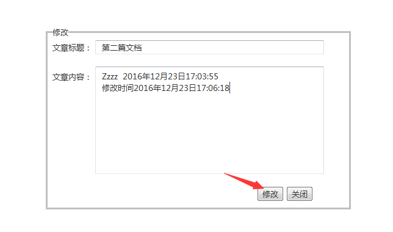

我们再次点击进入详情页面时候，内容已经改变

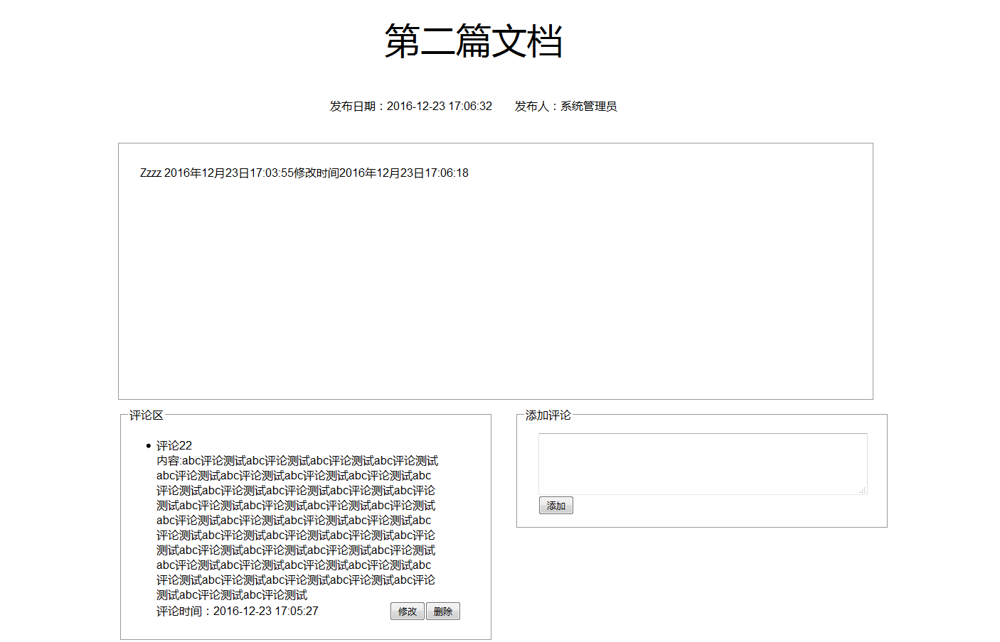

接下来我们对文档进行删除，点击删除按钮之后当前页面刷新

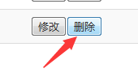

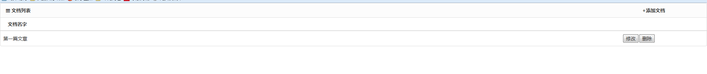

之前的内容就已经被我们删除
